# Diagrama de Integración de Microservicios
## Sistema de Gestión de Eventos Sociales

---

## 1. Arquitectura General de Microservicios

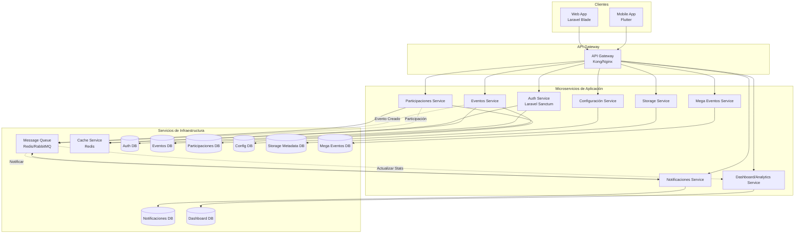

---

## 2. Flujo de Comunicación entre Microservicios

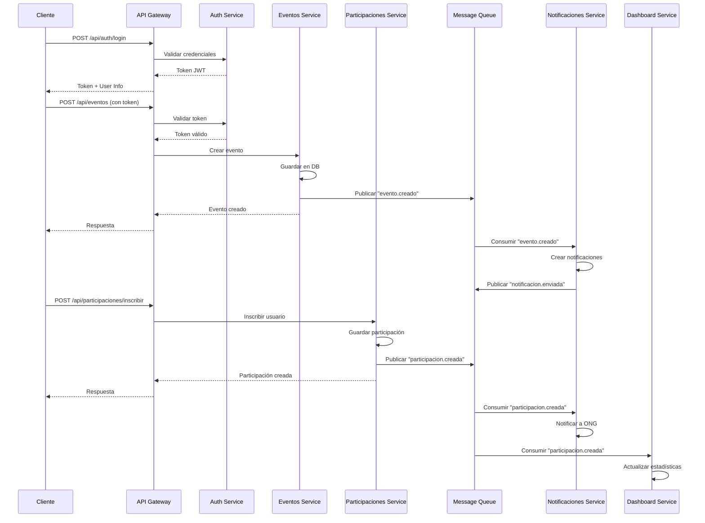

---

## 3. Desglose de Microservicios

### 3.1 Auth Service
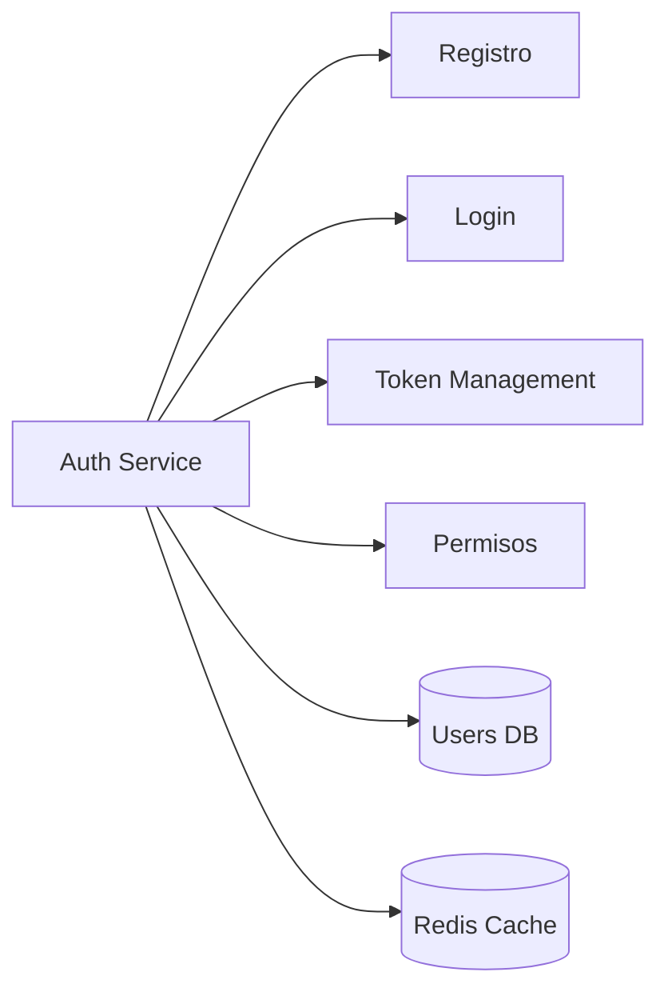

**Responsabilidades:**
- Registro de usuarios (ONG, Empresa, Externo)
- Autenticación y generación de tokens JWT
- Validación de tokens
- Gestión de permisos y roles
- Sesiones y refresh tokens

---

### 3.2 Eventos Service
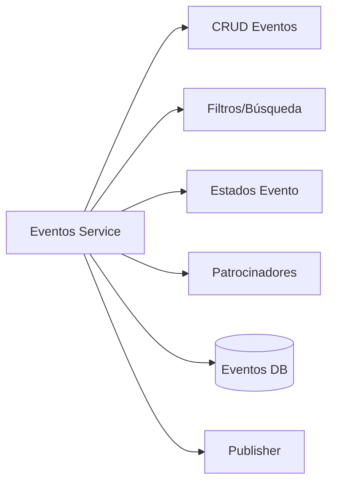

**Responsabilidades:**
- Crear, leer, actualizar, eliminar eventos
- Gestión de estados (Borrador, Publicado, Finalizado)
- Asociación de patrocinadores
- Búsqueda y filtrado de eventos
- Publicar eventos a Message Queue

---

### 3.3 Participaciones Service
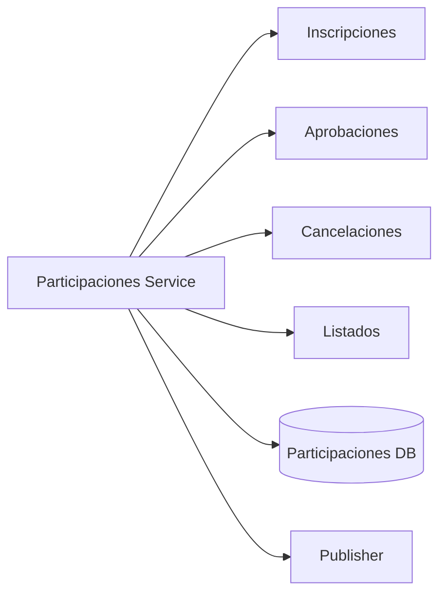

**Responsabilidades:**
- Inscripción de usuarios a eventos
- Aprobación/rechazo de participaciones
- Cancelación de participaciones
- Listado de participantes por evento
- Publicar eventos de participación

---

### 3.4 Notificaciones Service
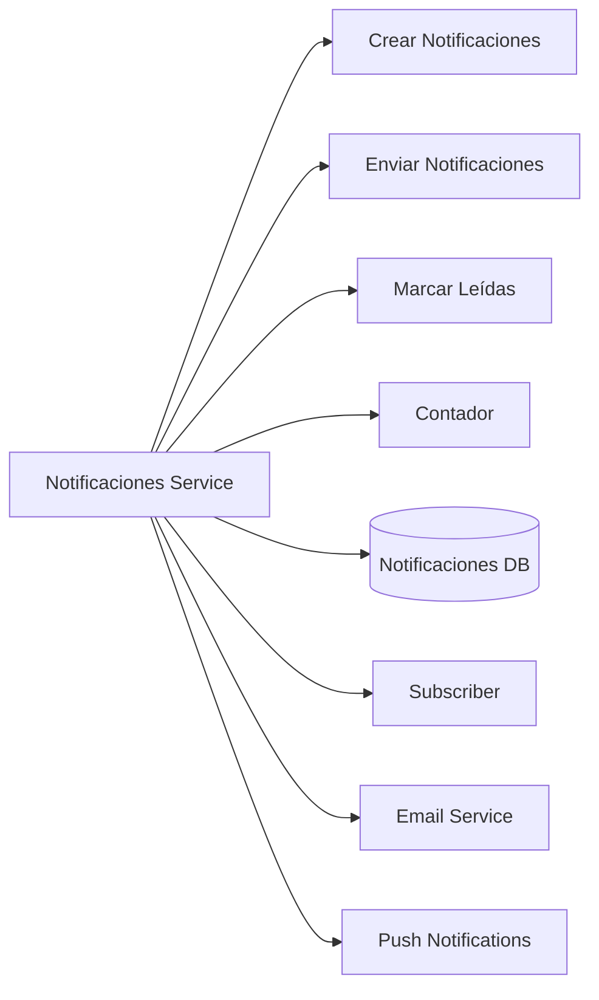

**Responsabilidades:**
- Crear notificaciones desde eventos
- Enviar notificaciones (email, push, in-app)
- Marcar notificaciones como leídas
- Contador de notificaciones no leídas
- Consumir eventos de otros servicios

---

### 3.5 Dashboard/Analytics Service
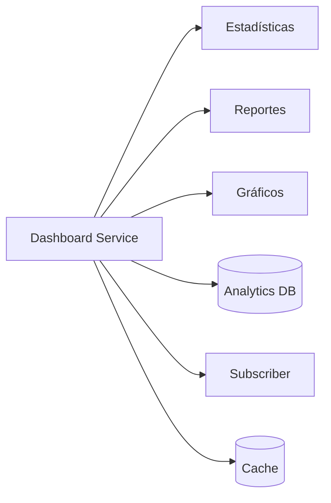

**Responsabilidades:**
- Estadísticas generales de ONG
- Estadísticas de participantes
- Estadísticas de reacciones
- Generación de reportes
- Consumir eventos para actualizar métricas

---

### 3.6 Configuración Service
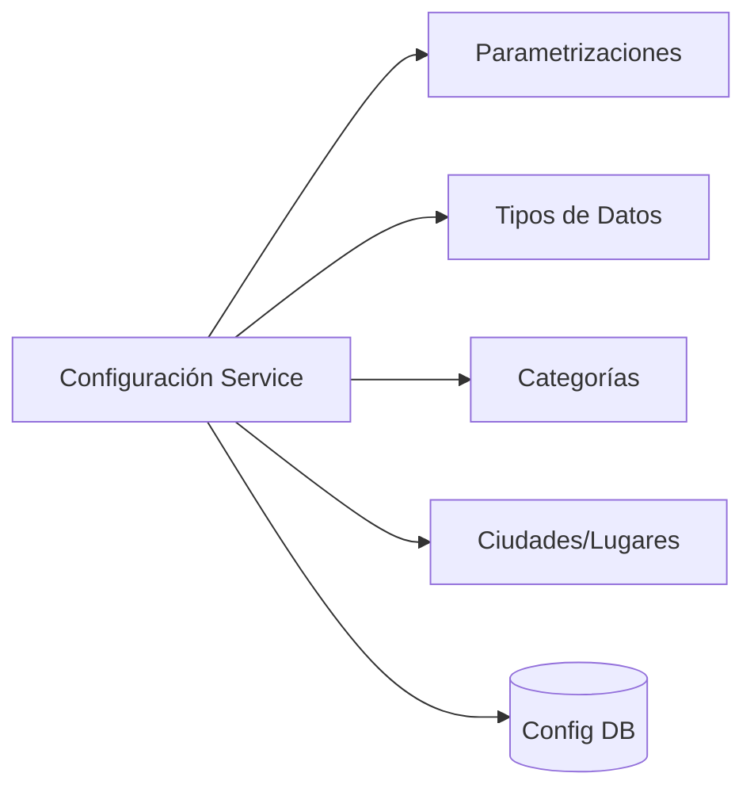

**Responsabilidades:**
- Gestión de tipos de evento
- Categorías de mega eventos
- Ciudades y lugares
- Estados de participación
- Tipos de notificación
- Configuraciones del sistema

---

### 3.7 Storage Service
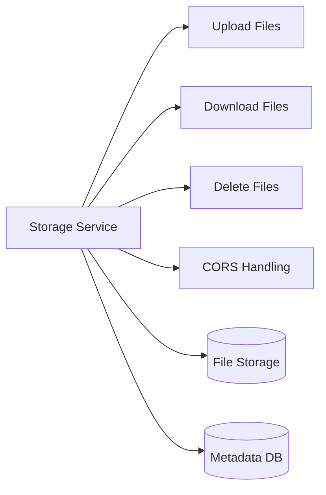

**Responsabilidades:**
- Subida de archivos (imágenes, documentos)
- Servir archivos con CORS
- Eliminación de archivos
- Gestión de metadatos
- Optimización de imágenes

---

### 3.8 Mega Eventos Service
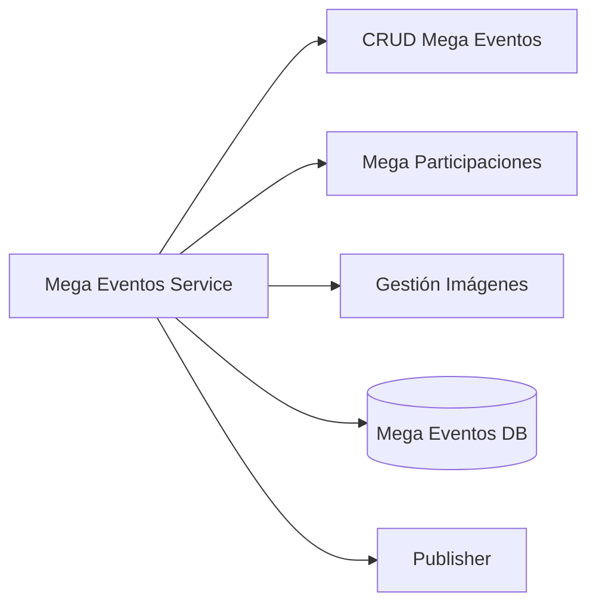

**Responsabilidades:**
- Crear, leer, actualizar, eliminar mega eventos
- Participación en mega eventos
- Gestión de imágenes
- Publicar eventos relacionados

---

## 4. Tecnologías y Protocolos

### Comunicación Síncrona
- **REST API**: Comunicación HTTP/REST entre cliente y servicios
- **API Gateway**: Kong, Nginx, o AWS API Gateway
- **Autenticación**: JWT tokens (Laravel Sanctum)

### Comunicación Asíncrona
- **Message Queue**: Redis Queue, RabbitMQ, o Apache Kafka
- **Eventos**: Event-driven architecture para desacoplamiento
- **Patrón**: Publisher/Subscriber

### Bases de Datos
- **Por Servicio**: Cada microservicio tiene su propia base de datos
- **Tipos**: MySQL/PostgreSQL para datos relacionales, Redis para cache
- **Replicación**: Read replicas para servicios de lectura intensiva

### Infraestructura
- **Contenedores**: Docker para cada microservicio
- **Orquestación**: Kubernetes o Docker Compose
- **Service Discovery**: Consul, Eureka, o Kubernetes DNS
- **Load Balancing**: Nginx, HAProxy, o Kubernetes Service

---

## 5. Patrones de Integración

### 5.1 API Gateway Pattern
- Punto único de entrada para todos los clientes
- Enrutamiento de solicitudes a microservicios
- Autenticación y autorización centralizada
- Rate limiting y throttling
- Logging y monitoreo

### 5.2 Event-Driven Architecture
- Desacoplamiento entre servicios
- Escalabilidad horizontal
- Resiliencia ante fallos
- Event sourcing para auditoría

### 5.3 Database per Service
- Cada microservicio tiene su propia base de datos
- Independencia de datos
- Escalabilidad independiente
- Tecnologías específicas por servicio

### 5.4 CQRS (Command Query Responsibility Segregation)
- Separación de comandos (escritura) y consultas (lectura)
- Optimización de lecturas con vistas materializadas
- Dashboard Service puede usar CQRS

---

## 6. Flujo de Datos Completo

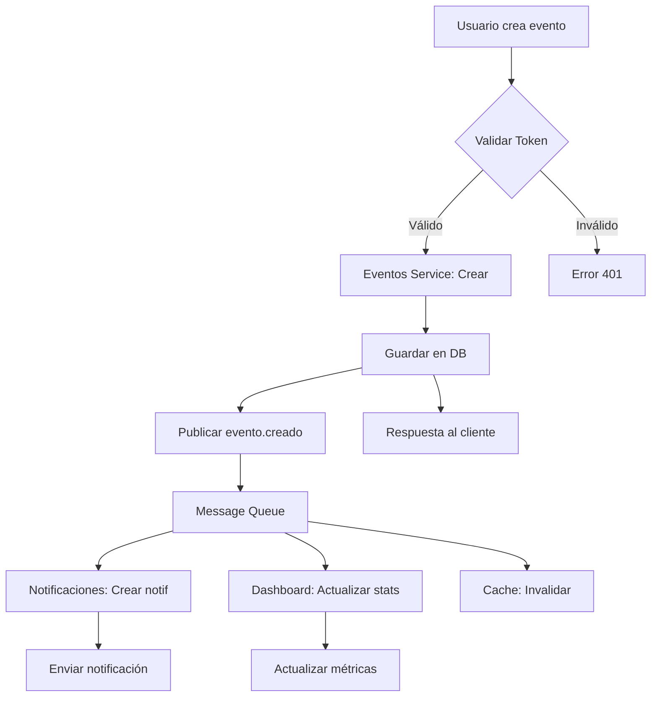

---

## 7. Consideraciones de Seguridad

- **Autenticación**: JWT tokens con expiración
- **Autorización**: RBAC (Role-Based Access Control)
- **HTTPS**: Todas las comunicaciones encriptadas
- **Rate Limiting**: Protección contra abuso
- **CORS**: Configuración adecuada para clientes
- **Validación**: Validación de entrada en cada servicio
- **Sanitización**: Prevención de inyecciones SQL/XSS

---

## 8. Monitoreo y Observabilidad

- **Logging**: Logs centralizados (ELK Stack, Loki)
- **Métricas**: Prometheus + Grafana
- **Tracing**: Distributed tracing (Jaeger, Zipkin)
- **Health Checks**: Endpoints de salud en cada servicio
- **Alertas**: Notificaciones de errores y fallos

---

## 9. Escalabilidad

- **Horizontal Scaling**: Múltiples instancias de cada servicio
- **Load Balancing**: Distribución de carga
- **Caching**: Redis para datos frecuentemente accedidos
- **Database Sharding**: Particionamiento de bases de datos grandes
- **CDN**: Para archivos estáticos y storage

---

## 10. Despliegue

### Desarrollo
- Docker Compose para todos los servicios
- Hot reload para desarrollo local

### Producción
- Kubernetes para orquestación
- CI/CD con GitLab CI, GitHub Actions, o Jenkins
- Blue-Green o Canary deployments
- Rollback automático en caso de errores

---

## Notas Finales

Este diagrama representa una arquitectura de microservicios ideal para el sistema de gestión de eventos sociales. La migración desde la aplicación monolítica actual debería realizarse de forma gradual, comenzando con servicios menos acoplados como Notificaciones o Storage, y luego continuar con los servicios principales.

